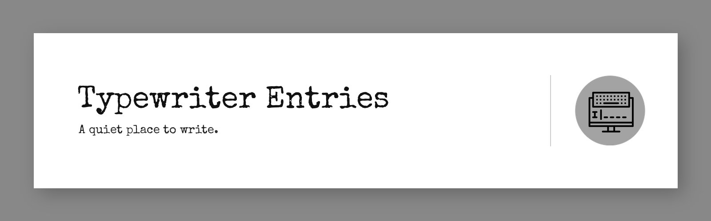
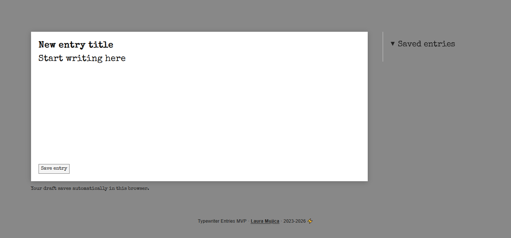

[Try the prototype](https://laumujica.github.io/typewriter_entries/).

I started Typewriter Entries on **August 11, 2023**, inspired by writing and by the idea of a digital space devoted to a single task. The interface offers a title, a generous writing area, and a list of saved entries. There are no settings for fonts, sizes, or page layout: writing comes first, and editing can happen later.

## The experience

1. Write a title and a text. The unfinished draft is saved automatically in this browser as you type, so you can return to it after accidentally closing the page.
2. Select **Save entry** to add it to **Saved entries**.
3. Open an entry and download a multipage A4 PDF named after its title, with the export date and the same Special Elite typeface as the editor.

*Current MVP interface, September 2026.*

This is an experimental MVP. Entries and drafts can be lost if browser site data is cleared, so download a PDF to keep a copy of writing that matters.

## What I built

I designed the focused writing flow and visual direction, then built the interface in HTML, CSS, and JavaScript. The PDF is created in the browser with jsPDF and an embedded typeface. The site is published with GitHub Pages. I used Firebase Realtime Database and anonymous authentication to learn how to connect a small web product to persistent storage without interrupting the writing flow with a sign-in screen.

I returned to the project in 2026 to repair saving and PDF export, refine the responsive layout, and document how the product has evolved. It remains a place for me to experiment with product design and editorial workflows.

## What comes next

- Export an editable Word document for the next stage of writing and revision.
- Explore optional account recovery so entries can be found across devices.
- Test the writing experience with people before expanding the feature set.

## Project files

- `index.html` and `styles.css`: writing interface and responsive layout.
- `js/script.js`: editor, saved entries, draft recovery, and Firebase connection.
- `js/pdfGenerator.js`: dated A4 PDF export.
- `database.rules.json`: Firebase Realtime Database rules.
- `fonts/`: bundled Special Elite font and its license.
- [Original 2023 process log](docs/archive/README-2023.md): preserved as an archive of the first version.

**Laura Mujica · 2026 ⚡** 
[lauramujica.com](https://lauramujica.com/)
